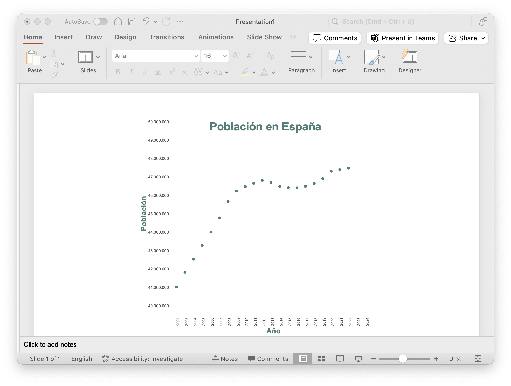

---
output:
  pdf_document: default
  html_document: default
---

# Truco para infografías

En este apartado se expondrá como exportar por capas un gráfico de R a Power Point/ Photoshop. Este método puede resultar muy útil para realizar ciertas infografías, ya que en la herramienta de destino se puede modificar el formato del gráfico fácilmente.

Tomemos los datos de la población de España desde 2010 hasta 2022, para ello usaremos la API desarrollada para la obtención de datos. Para más información sobre esta, véase [@ineapir].

1. **Buscar identificador de la serie**. Abriendo los datos en la web del INE, vemos que el código identificador de la serie es `ECP320` (véase cheatsheet de [@ineapir]).

2. **Cargar los datos** usando función `ineapir::get_data_series()`.

```{r}
# Verificar si el paquete está instalado
if (!require("ineapir")) remotes::install_github("es-ine/ineapir")


# Cargar paquete
library(ineapir)

# Cargar Serie Población ECP320
a <- get_data_series("ECP320", dateStart = "2002/01/01", unnest = TRUE, tip = "AM")
datos <- data.frame(
  fecha = as.Date(a$Fecha),
  pob = a$Valor
)

# Formateamos año y mes
datos$year <- format(datos$fecha, "%Y")
datos$month <- format(datos$fecha, "%m")

# Filtramos para tener sólo población a 1 de Enero
datos <- datos[datos$month == "01", ]
```

3. Crear gráfico que represente la población a lo largo de los años.

```{r, fig.cap="Evolución de la población a lo largo de los años."}
# Verificar si está instalado
if (!require("ggplot2")) install.packages("ggplot2")
library(ggplot2)


# Function to set numbers with marks and without scientific notation
marks_no_sci <- function(x) format(x, big.mark = ".", decimal.mark = ",", scientific = FALSE)


# Crear el gráfico de puntos
grafico <- ggplot(datos, aes(x = year, y = pob)) +
  geom_point(stat = "identity", color = "#457e76") +
  labs(title = "Población en España", x = "Año", y = "Población") +
  theme_minimal() +
  theme(axis.text.x = element_text(angle = 90, hjust = 1)) +
  scale_y_continuous(labels = marks_no_sci, limits = c(40000000, 50000000), breaks = seq(40000000, 50000000, by = 1000000))

grafico
```

Ahora imaginar que un equipo quiere realizar una infografía con este gráfico. Se puede guardar como `.svg` de tal manera que sea un gráfico vectorial y se pueda abrir en aplicaciones como Photoshop o Power Point.

Veamos:

```{r}
# Verificar si el paquete está instalado
if (!require("svglite")) install.packages("svglite")
library(svglite)
ggsave(file = "/Users/davpero/Desktop/grarfico.svg", plot = grafico)
```

Por ejemplo: Pegamos el gráfico en Power Point y clickando con el botón derecho le damos a Grupo-\> Desagrupar. Lo que conseguimos es dejar la imagen como elementos vectoriales independientes, tal y como se puede ver en la Figura \ref{fig:imagencapas}

```{r label="imagencapas", echo = TRUE, fig.cap = "Pegado del gráfico como imagen vectorial", out.width = '40%',fig.show='hold',fig.align='center' }
knitr::include_graphics(c("fig/capturas/plot1.png", "fig/capturas/plot2.png"))
```

Posteriormente, en Power Point, el equipo de infografías puede darle el formato deseado sin necesidad de tener que modificar el gráfico desde su código fuente (ggplot2). No obstante, estos cambios posibles se reducen a aspectos de formato tal como cambiar el tamaño de letra, colores, o eliminar elementos.

Veamos pues como eliminamos las rayas de fondo y cambiamos el tamaño y color de los textos:

```{r  echo = TRUE, fig.cap = "Modificación del gráfico en Power Point", out.width = '50%',fig.show='hold',fig.align='center' }

```


# (PART\*) Paquetes principales {-}


# lattice

El paquete **lattice** es una herramienta poderosa para la visualización de datos multivariantes en R. Desarrollado por Deepayan Sarkar, lattice está basado en el concepto de gráficos en trellis [^01-intro-1], que facilita la visualización de relaciones complejas entre múltiples variables mediante la creación de gráficos condicionados. Esto es especialmente útil en análisis exploratorios de datos, donde es crucial comprender las interacciones y patrones en conjuntos de datos grandes y complejos.

[^01-intro-1]: Un **gráfico en trellis** es una visualización que presenta múltiples gráficos dispuestos en un conjunto de paneles, permitiendo comparar diferentes subconjuntos de datos de manera eficiente. Cada panel muestra el mismo tipo de gráfico, pero para diferentes segmentos de datos, facilitando la detección de patrones y tendencias en grupos distintos. Véase [https://es.wikipedia.org/wiki/Gráfico_de_celosía](https://es.wikipedia.org/wiki/Gr%C3%A1fico_de_celos%C3%ADa)

## Características Principales

1.  **Gráficos Condicionados**: lattice permite crear gráficos que muestran relaciones entre variables condicionadas a los valores de otras variables. Esto facilita la visualización de patrones en subgrupos de datos.
2.  **Paneles Múltiples**: Los gráficos pueden ser divididos en paneles múltiples, cada uno mostrando una porción diferente del conjunto de datos, lo que permite una comparación visual directa entre diferentes subgrupos.
3.  **Fórmulas**: Utiliza una fórmula para especificar las relaciones entre las variables que se van a graficar, proporcionando una sintaxis clara y concisa.
4.  **Temas Personalizables**: lattice permite la personalización de temas gráficos, incluyendo colores, tamaños y tipos de letra, lo que facilita la creación de visualizaciones estéticamente agradables.
5.  **Integración con el Modelo de Trellis**: La integración con el modelo de Trellis permite la creación de gráficos consistentes y bien organizados.

Lo primero escribimos unas líneas de código que verifiquen si el paquete está instalado, y en caso negativo lo instalen. Posteriormente lo cargamos:

```{r}
# Verificar si el paquete está instalado
if (!require("lattice")) install.packages("lattice")

# Cargar paquete
library(lattice)
```

Como se comentaba, la principal funcionalidad de este paquete es que permite diferenciar cualquier tipo de gráfico (Diagrama de dispersión, Histograma,... ) a partir de una variable categórica mostrando diferentes gráficos o superpuestos en uno mismo. Para ilustrar lo ventajoso de este gráfico se expondrá un ejemplo:

```{r,eval=FALSE, echo=FALSE}

Veamos pues, con un ejemplo de datos, como usar el paquete de lattice. Para ello tomaremos los datos de la web del INE (usareamos paquete ineapir).

# Verificar si está instalado
if (!require("ineapir")) remotes::install_github("es-ine/ineapir")

# Cargar paquete
library(ineapir)
```

```{r,eval=FALSE, echo=FALSE}
a <- get_data_table(idTable = "t26/p067/p03/serie/l0/02001.px", unnest = TRUE)
for (i in 1:length(a$Nombre)) {
  a$Nombre1[i] <- strsplit(a$Nombre, split = "[,]")[[i]][1]
  a$Nombre2[i] <- last(strsplit(a$Nombre, split = "[,]")[[i]])
}
a <- a[a$NombrePeriodo == "2018", ]

datos <- data.frame(Nombre1 = a$Nombre1, Nombre2 = a$Nombre2, Valor = a$Valor)

# Verificar si está instalado
if (!require("dplyr")) install.packages("dplyr")
# Cargar paquete
library(dplyr)

datos <- datos %>%
  pivot_wider(names_from = Nombre2, values_from = Valor)


plot(x = datos$` Aguas superficiales`, y = datos$` Aguas subterráneas`)

a <- c("1", "2", "3", "4")

paste(a, collapse = " ")
```

## Datos de ejemplo

Vamos a usar el conjunto de datos `mtcars` que pertenece al paquete [datasets](https://www.rdocumentation.org/packages/datasets/versions/3.6.2/topics/mtcars) el cual fue elaborado para la revista *Motor Trend US* en 1974 y que contiene el consumo de combustible y 10 aspectos relacionados con el diseño y rendimiento para 32 coches distintos. Es un dataset muy usado en el aprendizaje de R y que permite ejemplificar diversas técnicas estadísticas.

Variables del dataset mtcars:

1.  **mpg**: Medida autonomía del coche. Millas recorridas por galón de combustible (miles per gallon)
2.  **cyl**: Número de cilindros
3.  **disp**: Desplazamiento (pulgadas cúbicas)
4.  **hp**: Potencia (caballos de fuerza)
5.  **drat**: Relación del eje trasero
6.  **wt**: Peso del auto (miles de libras)
7.  **qsec**: Tiempo de 1/4 de milla (en segundos)
8.  **vs**: Tipo de motor (0 = V-shaped, 1 = Straight)
9.  **am**: Tipo de transmisión (0 = Automática, 1 = Manual)
10. **gear**: Número de marchas
11. **carb**: Número de carburadores

```{r}
data <- mtcars
data$gear <- factor(data$gear, levels = c(3, 4, 5))
data$cyl <- factor(data$cyl, levels = c(4, 6, 8))
head(data)
```

Suponer que se desea mostrar la relación entre `mpg` y `hp` para ver si hay relación entre la velocidad y la potencia del coche. Por ello, parece razonable realizar un gráfico tipo:

```{r,fig.cap=" Gráfico de dispersión de potencia y auonomía de los automóviles."}
plot(hp ~ mpg, data = data, main = " Autonomía (mpg) vs. Potencia (hp) ")
```

Se observa que a medida que aumenta la potencia del motor (hp), disminuye el consumo de combustible medido en millas por galón (mpg), lo cual tiene sentido ya que a mayor potencia de un coche, más combustible se espera que gaste, y por tanto menor autonomía tendrá.

Ahora suponer que queremos hacer distinciones en función del número de cilindros del coche, es decir, el mismo **gráfico de dispersión condicionado por el número de cilindros**:

```{r,fig.cap="Gráfico de dispersión condicionado por el número de cilindros."}
plot(hp ~ mpg, col = factor(cyl), data = data, main = " Autonomía (mpg) vs. Potencia (hp) ")
# Legend
legend("topright",
  title = "Cilindros",
  legend = levels(factor(data$cyl)),
  pch = 19,
  col = factor(levels(factor(data$cyl)))
)
```

Se sigue observando una relación inversa entre potencia y autonomía de los automóviles, teniendo en cuenta que los de mayor cilindrada son los que mayor potencia y menor autonomía tienen. A medida que aumente el número de observaciones se tenderá a ver muy lleno el gráfico por lo que convendrá separar en varios gráficos dependiendo del número de cilindros.

## Realización manual

Para separar estos tres gráficos, de manera "manual", se procedería:

```{r, out.width="50%",fig.cap="Gráfico de dispersión condicionado por el número de cilindros (separados)."}
# Disposición de los gráficos
par(mfrow = c(1, 3))
# 4 cilindros
plot(hp ~ mpg, data = data[data$cyl == 4, ], main = "4 cilindros", col = "black")

# 6 cilindros
plot(hp ~ mpg, data = data[data$cyl == 6, ], main = "6 cilindros", col = "red")

# 8 cilindros
plot(hp ~ mpg, data = data[data$cyl == 8, ], main = "8 cilindros", col = "green")
```

Conforme aumente el número de categorías, realizar estos gráficos será tedioso y ahí es donde entra en juego el paquete `lattice`

## Realización automática (lattice)

Véase que el siguiente gráfico realiza la misma tarea con mucho menos código:

```{r,fig.cap="Gráfico de dispersión con lattice condicionado por el número de cilindros."}
# Gráfico por número de cilindros
xyplot(hp ~ mpg | cyl, group = cyl, data = data, scales = "free", aspect = "fill")
```

Además, se pueden combinar en un miso gráfico al igual que antes (quitando `| cyl`):

```{r,fig.cap="Gráfico de dispersión con lattice condicionado por el número de cilindros."}
# Gráfico
xyplot(hp ~ mpg, group = cyl, data = data, scales = "free", aspect = "fill")
```

Es decir, veamos las forma general de esta función **Custom block ver info**

```{r,eval= FALSE}
plot_function(y ~ x | g, group = g, data)
```

donde:

-   **plot_function**: es cualquier función de graficar de `lattice`, por ejemplo
    -   **xyplot**: Diagrama de dispersión
    -   **density.plot**: Línea de densidad
    -   **histogram**: Histograma
    -   **bwplot**: Diagramas de caja
-   **\| g** (OPCIONAL): Indica que el gráfico se va a dividir en tantos gráficos como valores tome la variable `data$g`. Es decir, nos mostrará el gráfico de `y~x` para cada grupo de la variable `g`
-   **group=g**(OPCIONAL): indica que pinte los elementos dibujados agrupando por la variable `g`.
-   **data**: nombre del conjunto de datos que contiene las variables `x,y,g`.

En el **siguiente ejemplo**, queremos representar la densidad de la autonomía de los vehículos (mpg) distinguiendo el número de cilindros que tienen, por ello:

-   Añadir `densityplot(~mpg,data = data)` para el gráfico de densidad.
-   Añadir argumento `| cyl` para realizar un gráfico por cada número de cilindros distinto.
-   Añadir argumento `gorup=cyl` para colorear dependiendo del número de cilindros del vehículo.

```{r,fig.cap="Densidad de la autonomía condicionada al número de cilindros (en gráficos distintos)."}
# Gráficos independientes
densityplot(~ mpg | cyl, group = cyl, data = data, plot.points = TRUE)
```

Ahora vamos a mostrarlos todos superpuestos en un mismo gráfico, eliminando el argumento `| cyl`:

```{r,fig.cap="Densidad de la autonomía condicionada al número de cilindros."}
# Superpuestos
densityplot(~mpg, group = cyl, data = data, plot.points = FALSE)
```

## Más información

Para más información acerca del paquete `lattice` y casos de uso, consultar:

-   [Página del paquete en CRAN:](https://cran.r-project.org/web/packages/lattice/index.html)

-   Sarkar, Deepayan. [*Lattice: Multivariate Data Visualization with R*](https://link.springer.com/book/10.1007/978-0-387-75969-2). Springer, 2008. Este libro proporciona una cobertura completa de las capacidades de `lattice` para la visualización de datos multivariantes en R.

-   [R Documentation - lattice](https://www.rdocumentation.org/packages/lattice/versions/0.20-41). Página de documentación que proporciona ejemplos de uso, detalles de funciones y comentarios de la comunidad.

-   [Quick-R: Lattice Graphs](https://www.datacamp.com/doc/r/trellis) Un tutorial práctico que cubre los conceptos básicos de los gráficos `lattice` y proporciona ejemplos de código.
