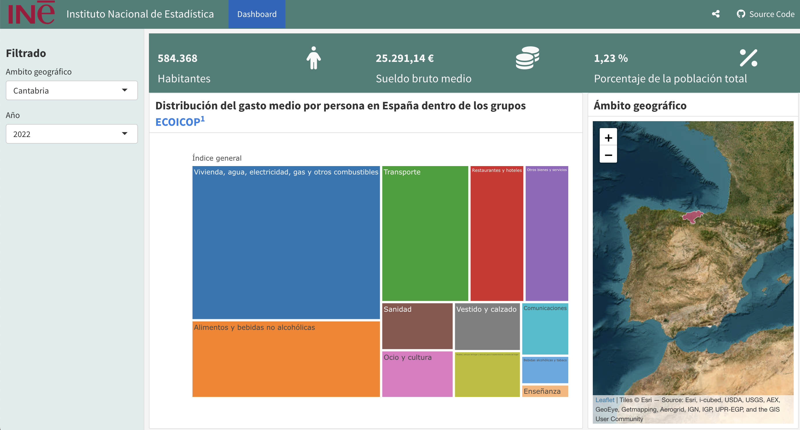

# Dashboards en R

Una de las principales ventajas de realizar dashboards en R es que este es de **software libre**, y que por tanto no se requiere licencias para su utilización. Además, con apoyo de librerías como *ineapir*, se puede combinar en un mismo documento el proceso que abarca desde la extracción de datos hasta la generación del dashboard, siendo a posteriori fácilmente actualizable.

En una época en la que la transparencia por parte de las instituciones se erige como pilar fundamental de sus principios, estos dashboards parecen la herramienta idónea para los constructores de estadísticas oficiales. Al ser de código abierto, se puede compartir el código fuente de los cuadros de mando, lo que conlleva ventajas significativas:

 - El **proceso de elaboración** es **público**, sirviendo como base para otros trabajos y viendo que no existen manipulaciones.
 - Se puede implementar servicios como **GitHub** que permiten a los usuarios hacer pull requests o abrir issues, creando una comunidad que mejore notablemente dichos recursos y que sirva como respaldo técnico.
 - Permite reusar (bajo la licencia elegida) los cuadros de mando fácilmente, aportando valor añadido y que su utlización aumente.


En el siguiente cuadro se expone la comparación de distintos servicios de creación de dashboards:

| Característica                             | R (Shiny)                              | Tableau                                | PowerBI                                |
|--------------------------------------------|----------------------------------------|----------------------------------------|----------------------------------------|
| **Facilidad de uso**                       | Intermedio, requiere conocimientos en R y programación | Alto, interfaz intuitiva y fácil de usar | Alto, interfaz intuitiva y fácil de usar |
| **Precio**                                 | Software libre                         | Licencia pagada, versiones disponibles según características | Licencia pagada, versiones disponibles según características |
| **Proceso completo**                       | Sí, desde la extracción de datos hasta la creación del dashboard | No, requiere herramientas adicionales para la extracción y procesamiento de datos | No, requiere herramientas adicionales para la extracción y procesamiento de datos |
| **Publicación web**                        | Sí, con `shinyapps.io` o servidores propios | Sí, con Tableau Public o Tableau Server | Sí, con PowerBI Service |
| **Actualización fácil**                    | Sí, puede automatizarse con scripts de R | Sí, pero puede requerir configuración adicional | Sí, pero puede requerir configuración adicional |
| **Código reutilizable**                    | Sí, scripts y funciones en R reutilizables | Limitado, se pueden reutilizar algunos componentes | Limitado, se pueden reutilizar algunos componentes |
| **Código abierto y replicable**            | Sí, código en R es abierto y puede ser revisado para transparencia | No, código cerrado                     | No, código cerrado                     |
| **Capacidad de integración**               | Alta, puede integrarse con muchas fuentes de datos y otras herramientas de R | Alta, se puede conectar a muchas fuentes de datos pero con limitaciones en algunas integraciones | Alta, se puede conectar a muchas fuentes de datos pero con limitaciones en algunas integraciones |
| **Interactividad**                         | Alta, permite una interactividad compleja con `shiny` y `plotly` | Alta, permite interactividad pero con menos flexibilidad que Shiny | Alta, permite interactividad pero con menos flexibilidad que Shiny |
| **Escalabilidad**                          | Alta, puede manejar grandes volúmenes de datos dependiendo de la implementación | Media, puede manejar grandes volúmenes de datos pero requiere hardware adecuado | Alta, diseñado para manejar grandes volúmenes de datos con infraestructura adecuada |
| **Soporte y comunidad**                    | Amplia, fuerte comunidad de usuarios y mucha documentación | Amplia, fuerte comunidad de usuarios y soporte oficial | Amplia, fuerte comunidad de usuarios y soporte oficial |
| **Curva de aprendizaje**                   | Pronunciada, requiere aprender R y conceptos de programación | Baja, más fácil de aprender para usuarios sin experiencia técnica | Baja, más fácil de aprender para usuarios sin experiencia técnica |
| **Seguridad**                              | Alta, depende de la configuración del servidor | Alta, con opciones robustas en Tableau Server | Alta, con opciones robustas en PowerBI Service |
| **Visualización**                          | Alta, con gran flexibilidad y personalización | Alta, con una amplia gama de visualizaciones listas para usar | Alta, con una amplia gama de visualizaciones listas para usar |
| **Colaboración**                           | Media, se puede hacer a través de Git y otras herramientas de control de versiones | Alta, con Tableau Server y Tableau Online para colaboración en tiempo real | Alta, con PowerBI Service para colaboración en tiempo real |
| **Mantenimiento**                          | Requiere mantenimiento manual y gestión de dependencias | Requiere mantenimiento regular y gestión de licencias | Requiere mantenimiento regular y gestión de licencias |
| **Despliegue**                             | Flexible, puede desplegarse en cualquier servidor compatible | Controlado, generalmente a través de Tableau Server o Tableau Public | Controlado, generalmente a través de PowerBI Service |


A continuación se expondrán las dos principales herramientas de creación de dashboards en R, que son **FlexDashboard** y **Shiny**.


## Flexdashboard

Se trata de un paquete de R, [flexdashboarad](https://pkgs.rstudio.com/flexdashboard/), cuyo propósito es proporcionar una forma simple de escribir aplicaciones interactivas en R basadas en lenguaje Markdown, lo que permite escribir el contenido usando bloques de código R y luego transformarlo en un documento HTML o PDF que incluye gráficos y widgets. Las principales características de flexdashboard son:

- **Facilidad de uso**: Permite crear dashboards sin necesidad de escribir mucho código de interfaz. Simplemente organizando el contenido en secciones y filas se genera un diseño de panel intuitivo.

- **Layouts adaptativos**: Ofrece disposiciones flexibles, como filas y columnas, para distribuir los gráficos y tablas.


- **Interactividad básica**: Se pueden agregar elementos de interacción usando bibliotecas de gráficos interactivas, como plotly o highcharter, pero el nivel de interactividad es más limitado en comparación con [Shiny](https://shiny.posit.co/r/getstarted/shiny-basics/lesson1/index.html),que aunque no es interactivo por sí mismo, se pueden integrar elementos de Shiny para mejorar la interactividad.


### Construcción

De aquí en adelante se usará el siguiente dashboard:

(ref:cap) Flexdashboard disponible en la siguiente web [shinyapps.io/r_flexdashboard](http://yoiswv-david-p0rez.shinyapps.io/r_flexdashboard_copia) y código fuente en repositorio [github.com/davidperezros/r_flexdashboard](https://github.com/davidperezros/r_flexdashboard).

```{r label="imagencapas2", echo = TRUE, fig.cap = '(ref:cap)', out.width = '80%',fig.show='hold',fig.align='center' }

```


Este cuadro de mando contiene los siguientes **elementos fundamentales**:

  - **Filtro**: Permite seleccionar una Comunidad Autónoma y un Año, para el que se muestran los elementos visuales del dashboard.
  
  - **Cards**: Tarjetas visuales superiores que permiten resumir información de manera muy visual. Más adelante se muestra cómo se han construido.
  
  - **TreeMap**: Gráfico que muestra el la distribución del gasto medio por persona en la comunidad y año seleccionado dentro de los grupos ECOICOP. Para ver como se construye (Sección \@ref(treemaps)).
  
  - **Leaflet Map**: Mapa interactivo que muestra el ámbito geográfico seleccionado en el filtro.
  
  
### Estructura proyecto

Para crear un flexdashboard se ha seguido la guía oficial, disponible en [https://pkgs.rstudio.com/flexdashboard/](https://pkgs.rstudio.com/flexdashboard/).
Concretamente tenemos el siguiente esquema,

```{r, eval=FALSE}
r_flexdashboard_project/
├── .gitignore                # Archivo de configuración para Git
├── .Rhistory                 # Archivo de historial de R
├── _site.yml                 # Archivo de configuración del sitio
├── index.Rmd                 # Archivo principal de flexdashboard
├── r_flexdashboard.Rproj     # Archivo de proyecto de RStudio
├── README.md                 # Archivo de documentación README
└── style.css                 # Archivo CSS (este puede estar dentro de la carpeta styles/)

```
  
donde:

  - **.gitignore **: Contiene los archivos que se deben ignorar en git, es decir que no se desea tener un control de versiones de ellos.
  - **site.yml **: Archivo de configuración del sitio.
  - **index.Rmd**: Contiene todo el cuadro de mando. Desde la lectura de datos hasta la creación de elementos visuales y su presentación.
  - **r_flexdashboard.Rproj**: Ajustes globales del proyecto en R.
  - **README.md**: Archivo que muestra información en la página principal del repositorio en GitHub.
  - **style.css**: Archivo css de estilos, modificando los colores de las fuentes, tamaños, estructuras de elementos visuales...
  


## Ventajas de cada servicio
 
| Característica           | Flexdashboard                                         | Shiny                                      |
|--------------------------|-------------------------------------------------------|--------------------------------------------|
| **Nivel de Interactividad** | Básica; depende de las bibliotecas de gráficos       | Alta; interactividad avanzada y en tiempo real |
| **Facilidad de Uso**     | Fácil; requiere poco código de interfaz               | Moderada a compleja; más control pero más configuración |
| **Diseño y Layout**      | Layout basado en RMarkdown, limitado a filas/columnas | Totalmente personalizable mediante código en R |
| **Reactivo**             | Limitado; necesita Shiny para reactividad             | Totalmente reactivo                        |
| **Ideal para**           | Dashboards estáticos o semiestáticos                  | Aplicaciones web interactivas complejas    |


En general, flexdashboard es una excelente opción cuando se necesita construir dashboards rápidos y fáciles de usar sin necesidad de interactividad avanzada, mientras que [Shiny](https://shiny.posit.co/r/getstarted/shiny-basics/lesson1/index.html) es la mejor elección para aplicaciones complejas donde el usuario necesita manipular datos en tiempo real o realizar análisis detallados. Ambas herramientas pueden complementarse: un flexdashboard puede integrar componentes de [Shiny](https://shiny.posit.co/r/getstarted/shiny-basics/lesson1/index.html) para mejorar su interactividad, combinando la simplicidad de un panel con la potencia de una aplicación reactiva.


## Shiny


Se trata de un paquete de R, [shiny](https://pkgs.rstudio.com/shiny/), cuyo propósito es proporcionar una forma simple de realizar aplicaciones interactivas en R. Las principales características de flexdashboard son:

- **Separación de componentes**: Una aplicación Shiny típica se divide en dos partes principales: ui (interfaz de usuario) y server (servidor).

    - **ui:** Define el diseño y la apariencia de la aplicación. Incluye los elementos de la interfaz de usuario como botones, gráficos, tablas, etc.

    - **server:** Contiene la lógica de la aplicación, es decir, el código R que procesa los datos y genera la salida que se mostrará en la interfaz de usuario.
    
    
- **Flexibilidad**: Aunque la curva de aprendizaje de la herramienta puede ser un poco lenta, ofrece una alta flexibilidad a la hora de mostrar los elementos interactivos y manejar los datos.

- **Alta reactividad**: alta capacidad para actualizar de manera automática y eficiente la interfaz de usuario en respuesta a cambios en los datos de entrada o en la interacción del usuario.


- **Comunidad web**: Shiny cuneta con una amplia comunidad web (mayoritariamente en inglés), donde se puede encontrar ejemplos y respuesta a muchos de los problemas que puedan surgir durante su creación

- **Shiny para Pyhton**: La librería de shiny también está disponible en Python, por lo que una vez se aprenda a manejar se puede usar en ambos lenguajes de programación. Aunque tienen elementos diferentes propios de cada lenguaje de programación, la base es la misma y por tanto shiny se usa de manera similar en ambos lenguajes.

### Construcción y herramientas útiles


A la hora de empezar a crear una Shiny App (tanto en R como en Python), se recomienda seguir la guía [https://shiny.posit.co](https://shiny.posit.co), donde se explica los pasos básicos para crear una aplicación interactiva. 
Además existen otras webs muy útiles como pueden ser:

- **Shiny Gallery**: [https://shiny.posit.co/r/gallery/](https://shiny.posit.co/r/gallery/). Ofrece ejemplos de código de diversas aplicaciones shiny.

- **Componentes**:[https://shiny.posit.co/r/components/](https://shiny.posit.co/r/components/). Ofrece ejemplos de como incluir en la aplicación componentes que van desde sliders hasta value boxes,numeric inputs,..

- **Layouts**: Ofrece ejemplos de como implementar distintos layouts en nuestra aplicación, dependiento de nuestro objetivo. [https://shiny.posit.co/r/layouts/](https://shiny.posit.co/r/layouts/)

- **bslib**: [https://rstudio.github.io/bslib/](https://rstudio.github.io/bslib/) Librería de R que dispone de una interfaz interactiva y actualizada para shiny. Contiene layouts, theming y   una [app interactiva](https://bslib.shinyapps.io/build-a-box/) en la que se permite construir value boxes con el formato y iconos/gráficas deseados. Realmente útil.


Además hay infinidad de documentación web en internet sobre como realizar un shiny, mucha de ella en libros en formato bookdown.

## Publicación web

PExisten varias opciones para publicar tanto un shiny como un flexdahsboard y que un espectro amplio de potenciales consumidores tengan acceso a el. Las más comunes son:

- **PositCloud**: La cuenta básica es gratuita pero tiene un límite de apps publicadas y horas de consulta mensuales.
- **ShinyApps.io**: Es un producto de software como servicio (SaaS) alojado en la nube por Posit. Tiene planes gratuitos y de pago.


Para más información y ventajas de cada una, consultar las respectivas páginas principales de estos servicios. El flexdashboard y el shiny de estos ejemplos se han publicado con  *ShinyApps.io*.


## Shinylive

Existe una librería en R llamada [shinylive](https://posit-dev.github.io/r-shinylive/) 
 que permite ejecutar una aplicación shiny en la web sin necesidad de un servidor, como en sitios web estáticos, presentaciones o cursos en línea. Por lo tanto, puede ser interesante para subirlo a github y permitir crear una github pages. 
 
 Internamente, shinylive utiliza [WebAssembly](https://webassembly.org/) para permitir la ejecución de aplicaciones Shiny directamente en el navegador sin la necesidad de un servidor backend. Esto se logra al compilar el entorno R y las dependencias necesarias en WebAssembly, permitiendo que las aplicaciones Shiny sean completamente autónomas y puedan ser distribuidas como archivos HTML estáticos.
 
 
 ::: {.infobox .caution data-latex="{caution}"}
**CUIDADO:**

Shinylive explora que librerías se están usando en la aplicación shiny, para cargarlas vía precompilados de WebAssembly. En esta web se pueden consultar los paquetes qué se pueden encontrar precompilados, y por tanto usar. [https://repo.r-wasm.org/](https://repo.r-wasm.org/) 


Por lo tanto, **NO es posible usar** paquetes que no aparezcan en esa lista.

:::


